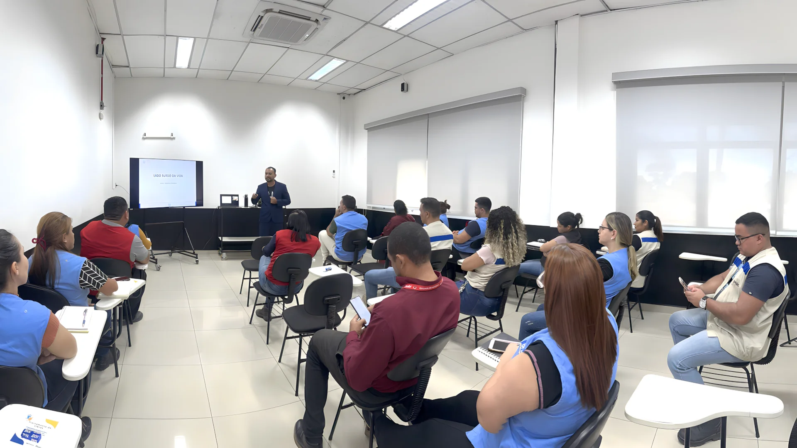

# Heberton Pinheiro Consultoria e Treinamento



## Visão Geral
Site institucional profissional para a **Heberton Pinheiro Consultoria e Treinamento**, especializada em inclusão social através do ensino e difusão da Língua Brasileira de Sinais (Libras). Deploy na Vercel em [hebertonpinheiro.com](https://hebertonpinheiro.com).

## Recursos Principais
- **WhatsApp Integrado** em todos os CTAs
- **Design 100% responsivo** e acessível
- **SEO otimizado** com Open Graph, Twitter Cards e Schema.org
- **VLibras Widget** para acessibilidade (tradução para Libras)
- **Skip-to-content** e navegação por teclado completa
- **Carrossel interativo** de serviços
- **Portal de Vagas Inclusivas** com filtros e busca
- **Video.js** para player de vídeos acessíveis
- **WCAG 2.1 AA** — estilos de foco, contraste, aria-labels

## Tecnologias
- HTML5 semântico
- CSS3 / Bootstrap 5.0.0
- JavaScript (jQuery 3.4.1)
- OWL Carousel
- WOW.js (animações)
- Video.js 8.10.0
- VLibras Widget (acessibilidade)

## Estrutura de Arquivos
```
heberton-pinheiro/
├── css/                    # Estilos (bootstrap + custom)
├── img/                    # Imagens do site
├── js/                     # Scripts JavaScript
├── lib/                    # Bibliotecas externas
├── videos/                 # Vídeos .mp4
├── index.html              # Página principal
├── consultor.html          # Perfil do consultor
├── sobre.html              # Missão, visão, valores
├── nossos-servicos.html    # Serviços oferecidos
├── contact.html            # Contato + mapa
├── videos.html             # Vídeos educativos
├── voluntario.html         # Voluntariado
├── parceiros.html          # Parceiros
├── vagas-inclusivas.html   # Portal de vagas PCD
├── vagas-script.js         # Lógica de vagas
├── vagas.json              # Dados de vagas
├── vercel.json             # Configuração Vercel
├── robots.txt              # Regras para crawlers
├── sitemap.xml             # Sitemap SEO
├── context.md              # Contexto do projeto
└── README.md               # Este arquivo
```

## Páginas
| Página | Descrição |
|---|---|
| `index.html` | Home — carrossel, sobre, serviços, equipe, contato |
| `consultor.html` | Perfil profissional de Heberton Pinheiro |
| `sobre.html` | Missão, visão, valores, vantagens |
| `nossos-servicos.html` | Consultoria, treinamentos, oficinas, palestras |
| `contact.html` | Contato + mapa Google |
| `videos.html` | Vídeos educativos com Video.js |
| `voluntario.html` | Formulário de voluntariado |
| `parceiros.html` | Parceiros + formulário de parceria |
| `vagas-inclusivas.html` | Portal de vagas inclusivas com filtros |

## Convenções
- **Lang:** `pt-BR`
- **Fontes:** Nunito (corpo) + Rubik (headings)
- **Cores:** `--primary: #044e91`, `--secondary: #34AD54`, `--dark: #091E3E`
- **WhatsApp:** `https://wa.me/5592984392169`

## Acessibilidade
- Skip-to-content link
- aria-labels em todos os elementos interativos
- aria-hidden em ícones decorativos
- Estilos de foco visíveis (`:focus-visible`)
- Suporte a `prefers-reduced-motion`
- Suporte a `prefers-contrast: high`
- VLibras Widget para traduçãoLibras

## Deploy
- **Plataforma:** Vercel
- **Domínio:** hebertonpinheiro.com

## Contato
- 📱 +55 92 98439-2169
- 📧 heberton.pinheiro.silva@gmail.com

---
© 2025 Heberton Pinheiro Consultoria e Treinamento. Todos os direitos reservados.
